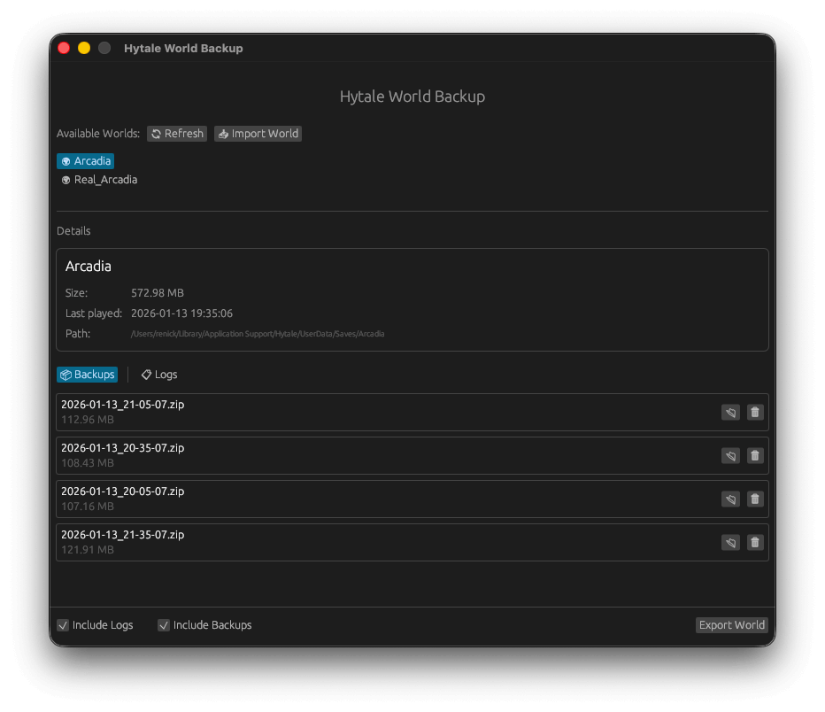
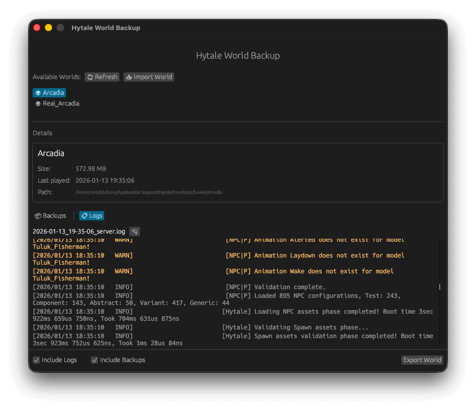

# Hytale World Exporter

<p align="center">
  
</p>

A cross-platform desktop application for backing up and restoring Hytale game worlds.

## Features

- 🖥️ Cross-platform (macOS & Windows)
- 🌍 View and select worlds with details (size, last played)
- 🗜️ Export worlds as ZIP with optional logs/backups exclusion
- 📥 Import/restore worlds from ZIP backups
- 📋 View server logs with syntax highlighting (WARN/ERROR)
- 📦 Manage existing world backups
- 🌐 Localized (English & German, auto-detected)
- 📊 Progress indicator during compression

## Installation

### Download

Download the latest release from [GitHub Releases](https://github.com/renickbuettner/hytale-world-exporter/releases).

### Building from Source

```bash
git clone https://github.com/renickbuettner/hytale-world-exporter.git
cd hytale-world-exporter
cargo build --release
```

### macOS: Open app by bypassing Gatekeeper

Since the app is not signed with an Apple Developer ID yet, macOS Gatekeeper may block it. To open the app:

1. Open Terminal
2. Run the following command, replacing the path with your app's path. You can drag-and-drop the app into the Terminal to get the correct path.
3. ```bash
   xattr -cr "/path/to/Hytale World Exporter.app"
   ```
4. Now try opening the app again.

## World Paths

- **Windows**: `%APPDATA%/Hytale/UserData/Saves`
- **macOS**: `~/Library/Application Support/Hytale/UserData/Saves`

## License

MIT License - see [LICENSE](LICENSE) file for details.

## Screenshots

<p align="center">
  
</p>

<p align="center">
  
</p>

